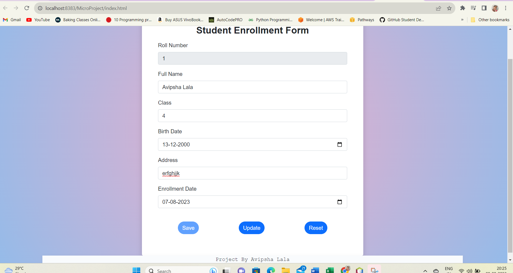

# Student Enrollment Form

It is a student registration form that uses JSONPowerDB to store user information. Both serverless technologies and REST APIs are supported. A student's roll number can be used to add or edit them. The roll number is automatically verified on this form, and with the use of an API, the data submitted into other input fields is also verified so that the user may change as necessary. AJAX requests are used by the program to provide quick and seamless interaction. Any type of data, including integers, strings, dates, etc., may be saved.


## Benefits of using JsonPowerDB

- Capable of storing huge data together with other file formats and organized, semi-structured, and unstructured data.
- Using CRUD operations while subject to dynamic relational restrictions. Relational data management is possible without PK, FK, UK, pre-defining databases,   
  tables, etc.
- Unrestricted by technology - Low-Code and simple to use through HTTP Rest AP from any technology.
- Reduces development costs, develops more quickly, and has minimal learning curves.
- Aids programmers in maintaining their databases with a variety of tools and methods.


## Release History
### JsonPowerDB
**Version:** 2.0
#### API Execution

```
var baseUrl = "http://api.login2explore.com:5577";
function executeCommand(reqString, apiEndPointUrl) {
    var url = baseUrl + apiEndPointUrl;
    var jsonObj;
    
    $.post(url, reqString, function (result) {
        jsonObj = JSON.parse(result);
    }).fail(function (result) {
        var dataJsonObj = result.responseText;
        jsonObj = JSON.parse(dataJsonObj);
    });
    return jsonObj;
}
```
#### Create a PUT Request String
```
function createPUTRequest(connToken, jsonObj, dbName, relName) {
    var putRequest = "{\n"
            + "\"token\" : \""
            + connToken
            + "\","
            + "\"dbName\": \""
            + dbName
            + "\",\n" + "\"cmd\" : \"PUT\",\n"
            + "\"rel\" : \""
            + relName + "\","
            + "\"jsonStr\": \n"
            + jsonObj
            + "\n"
            + "}";
    return putRequest;
}

```

## Features of the Form

-Simple to use
-Quick response
-A thorough user interface

## Tech Stack used

**Client:** HTML, CSS, Javascript

**Server:** JsonPowerDB


## Screenshots




### Mobile View


